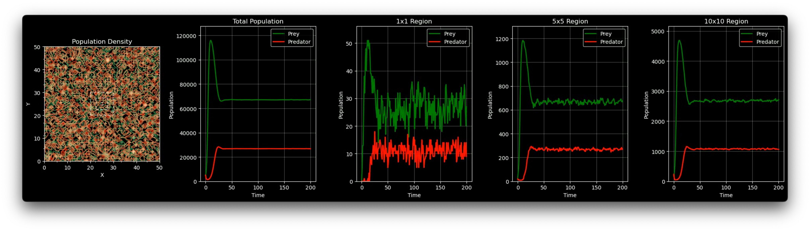
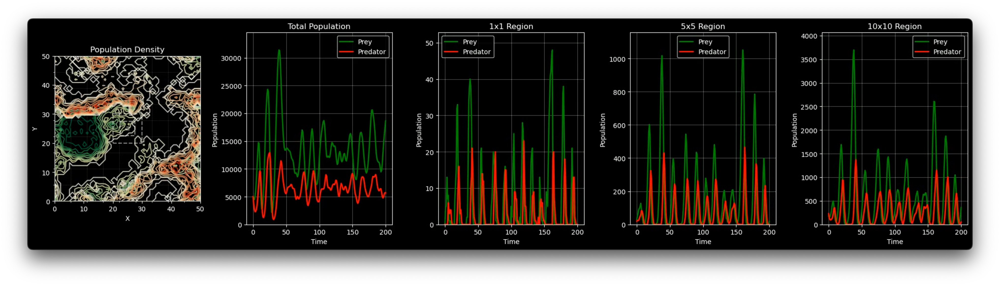

# Predator-Prey Simulation Model

Simulating Prey-Predator model in Grid 2D map. Based on Random Walk and Lotka-Volterra.

## Main Factor

1. **Lotka-Volterra 방정식**

   ```math
   \dot{u} = u - \frac{u^2}{K} - \frac{\beta u}{u+v}v
   \quad
   \dot{v} = \frac{\beta u}{u+v}v - v
   ```

   - u: 피식자 밀도
   - v: 포식자 밀도
   - K: 환경수용력
   - β: 포식률

2. **공간 이동 패턴**

   - `4dir`: 상하좌우 4방향 이동
   - `8dir`: 8방향 균등 이동
   - `8dir_weighted`: 대각선 이동에 가중치 적용

3. **경계 조건**
   - `periodic`: 주기적 경계 조건
   - `neumann`: 반사 경계 조건
   - `dirichlet`: 흡수 경계 조건

## Default Parameter

```python
config = {
   # 공간 파라미터
   'L': 50,                    # 공간 크기
   'n_grid': 10,               # 시각화용 격자 크기
   'boundary_condition': 'periodic',

   # 이동 설정
   'movement_pattern': '8dir',
   'prey_move_percent': 0.888,    # 피식자 이동 확률
   'predator_move_percent': 0.888, # 포식자 이동 확률

   # 초기 분포 설정
   'prey_location_rate': 0.2,     # 전체 공간 중 10%에 분포
   'prey_density': 10,            # 각 위치당 10배의 개체수
   'predator_location_rate': 0.2, # 전체 공간 중 10%에 분포
   'predator_density': 10,        # 각 위치당 10배의 개체수

   # Lotka-Volterra 파라미터
   'K': 50,                    # 환경수용력
   'beta': 2,                  # 포식률

   # 시뮬레이션 설정
   'total_steps': 100,         # 총 시뮬레이션 스텝
   'plot_interval': 1,         # 그래프 갱신 간격

   # 시각화 설정
   'figsize': (15, 5),
   'prey_color': 'YlGn',
   'predator_color': 'OrRd',

   # 비디오 설정
   'record_video': True,
   'video_fps': 30,
}
```

## Run

```bash
pip install numpy scipy matplotlib
```

```bash
python main.py
```

## Result

By modeling and simulating prey-predator map, we could find relation of L,Beta,K and population change. Beta had big influence on the change of population. If we set beta 1, we could find predator distincting. If beta gets bigger, predator more likely to make prey extinct. And as we set beta 3 we could find Density on map becoming more unstable.

### Simulation Result(K=1.5 K=2 K=3 in order)




